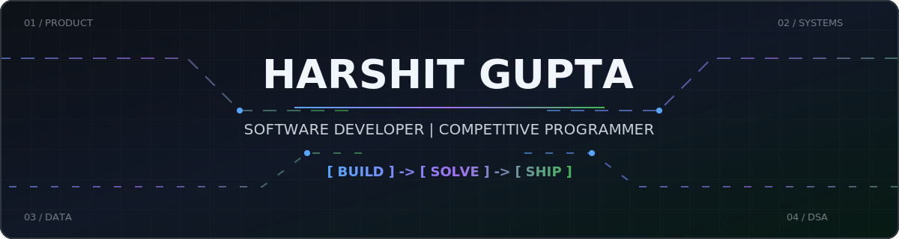
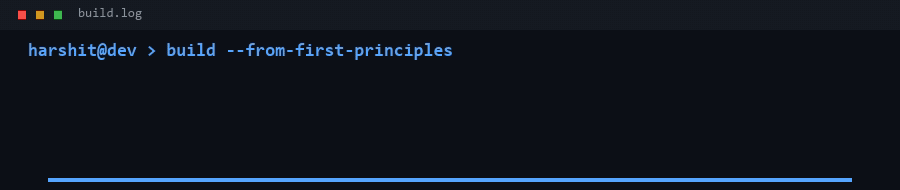
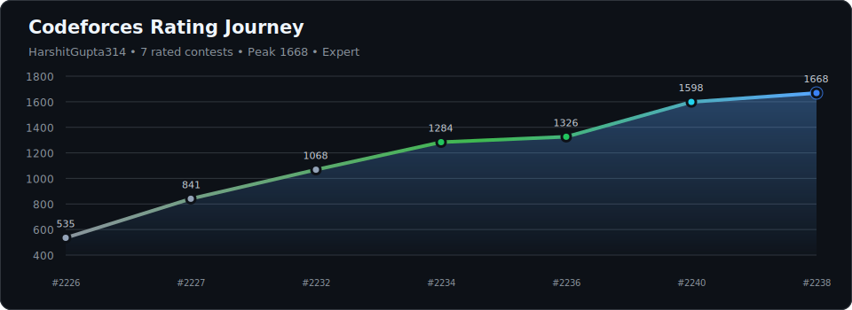
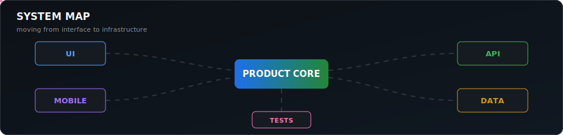

## About

I am a developer at **Vedonyx** who turns practical problems into web applications, Flutter apps, data tools, and developer utilities. I use competitive programming to sharpen my algorithmic thinking while I deepen my understanding of systems, databases, and production debugging.

## Professional Channels

## Selected Work

| Project | What it does | Built with |
| --- | --- | --- |
| [Prisma Schema Visualizer](https://github.com/harshitgupta31415/prisma-visualizer) | Turns Prisma schemas into interactive ER diagrams with relationship routing, focus states, zoom, pan, and PNG export. | TypeScript, Next.js, React |
| [MyCollegeFinance](https://github.com/harshitgupta31415/MyCollegeFinance_app) | A Flutter finance app designed around the budgeting needs of students. | Dart, Flutter |
| [Blood Donation Analysis](https://github.com/harshitgupta31415/blood-donation-analysis) | Explores more than 30,000 donor records to study demographics, donation behavior, and future donation likelihood. | Python, Pandas, Matplotlib, Seaborn |

## Competitive Programming

Generated from the official Codeforces API every six hours. 
[LeetCode: 300+ solved, contest rating 1645](https://leetcode.com/u/harshitgupta314/)

## Working Stack

| Area | Tools |
| --- | --- |
| Product | Next.js, React, Node.js, Flutter, Prisma |
| Languages | Python, TypeScript, JavaScript, Dart, SQL |
| Data and delivery | Pandas, NumPy, Matplotlib, Git, Vercel |

## Contribution Activity

