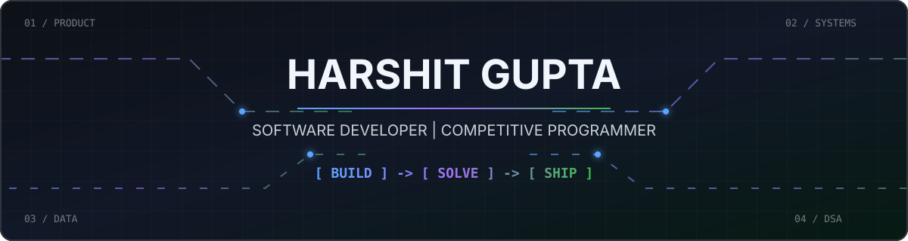

### 17-year-old full-stack developer building reliable systems · Codeforces Expert · 427+ problems solved

[LinkedIn](https://www.linkedin.com/in/harshit-gupta--) · [Email](mailto:harshitgupta3.1415@gmail.com) · [LeetCode](https://leetcode.com/u/harshitgupta314/) · [Codeforces](https://codeforces.com/profile/HarshitGupta314)

## About

I am a **17-year-old developer and CTO at [Vedonyx](https://www.vedonyx.com/)**, based in New Delhi, India. I work primarily with TypeScript, Python, React, FastAPI, PostgreSQL, and Flutter. I enjoy taking products beyond the demo stage: defining system boundaries, testing failure cases, documenting trade-offs, and deploying software that other people can evaluate.

## Selected engineering work

| Project | Engineering highlights | Stack |
| --- | --- | --- |
| [RollbackReady](https://github.com/harshitgupta31415/nycr3s1-frontend) · [API](https://github.com/harshitgupta31415/nycr3s1-backend) | Evidence-based Prisma migration review with deterministic checks, disposable PostgreSQL simulations, failure timelines, verified recovery plans, CI, containers, and cloud deployment. | Next.js, TypeScript, FastAPI, PostgreSQL, Docker, Kubernetes |
| [Prisma Schema Visualizer](https://github.com/harshitgupta31415/prisma-visualizer) · [Live](https://prisma-visualizer-six.vercel.app) | Interactive ER diagrams with relationship routing, obstacle avoidance, focus states, zoom, pan, and PNG export. | Next.js, React, TypeScript |
| [Memvora CLI](https://github.com/harshitgupta31415/memvora-cli) | Installable CLI for terminal capture, content hashing, offline queueing, workspace configuration, and authenticated synchronization. | Python, Typer, HTTPX |
| [VectorBridge](https://github.com/harshitgupta31415/cdr_to_svg) | Local-first CDR/SVG conversion interface with engine discovery, temporary-file cleanup, progress feedback, and light/dark themes. | TypeScript, Next.js, Node.js |

## Small tools, sharp boundaries

| Tool | What it solves |
| --- | --- |
| [envproof](https://github.com/harshitgupta31415/envproof) | Finds missing, empty, duplicate, and undocumented environment keys without exposing values. |
| [jsonshape](https://github.com/harshitgupta31415/jsonshape) | Detects breaking structural changes between JSON API payloads. |
| [portpick](https://github.com/harshitgupta31415/portpick) | Finds or safely reserves predictable TCP ports for local tools and test suites. |
| [PR Size Guard](https://github.com/harshitgupta31415/pr-size-guard) | Adds configurable pull-request size feedback without tokens or noisy bot comments. |
| [Stack Trace Sprint](https://github.com/harshitgupta31415/stack-trace-sprint) | Turns realistic failure traces into a keyboard-accessible debugging game. |
| [Repo Radar](https://github.com/harshitgupta31415/repo-radar) | Audits repository health and produces actionable local or CI reports. |
| [API Pulse](https://github.com/harshitgupta31415/api-pulse) | Checks endpoint availability, accepted statuses, and latency targets from a small contract. |
| [Contrast Lab](https://github.com/harshitgupta31415/contrast-lab) | Tests accessible colour pairs with exact WCAG calculations and shareable URLs. |

[Browse the complete project index →](PROJECTS.md)

## Open-source contributions

- [OpenClaw: seed Discord presence data after startup and reconnect](https://github.com/openclaw/openclaw/pull/141218) — merged with focused regression coverage and runtime-boundary validation.
- [OpenClaw: correct node-approval command examples](https://github.com/openclaw/openclaw/pull/153716) — merged documentation fix.
- [Kubernetes: update the gRPC dependency](https://github.com/kubernetes/kubernetes/pull/141976) — merged upstream contribution.

## Engineering focus

- **Product engineering:** accessible interfaces, typed APIs, authentication, persistence, and responsive interaction.
- **Backend systems:** Python services, PostgreSQL, migrations, validation, authorization, and failure-safe workflows.
- **Delivery:** automated tests, GitHub Actions, containers, Vercel, Cloud Run, and Kubernetes.
- **Problem solving:** Codeforces Expert with **427+ unique problems solved** across LeetCode and Codeforces—currently 368 on LeetCode and 59 on Codeforces.

## Competitive programming

The Codeforces dashboard is regenerated from the official API every six hours.

## Core toolkit

| Area | Tools |
| --- | --- |
| Languages | TypeScript, Python, JavaScript, Dart, SQL |
| Product | Next.js, React, Node.js, Flutter, FastAPI |
| Data | PostgreSQL, Prisma, SQLAlchemy, Pandas, NumPy |
| Delivery | GitHub Actions, Docker, Kubernetes, Vercel, Google Cloud |

Open to collaborating on developer tools, data products, and reliability-focused web systems.

